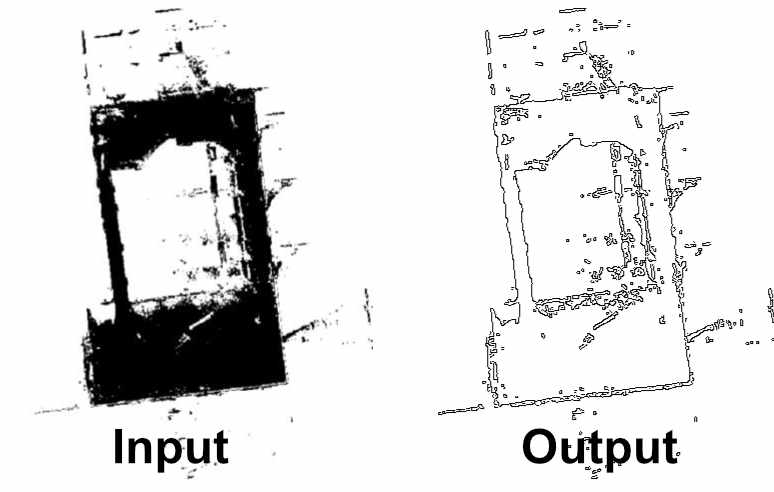

Canny Edge Detector
===

Runs the [Canny Edge Detection](https://en.wikipedia.org/wiki/Canny_edge_detector) algorithm on images uploaded to an REST endpoint.

## Run

To run this microservice in debug mode, execute `docker-compose up` (or `docker-compose up -d` to run in the background). The default port is `80` and can be adjusted in the `docker-compose.override.yml`.

Use the service with any web request tool like Postman or cUrl.

## Examples

### Query (cURL)
```bash
curl --location --request POST 'localhost/detect' \
--form 'file=@"./input.png"' \
--output "output.png"
```

### Result

